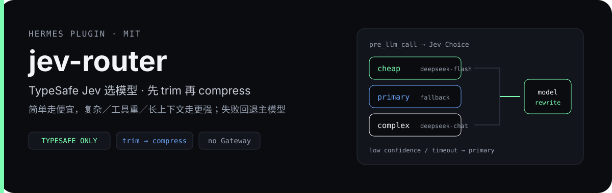
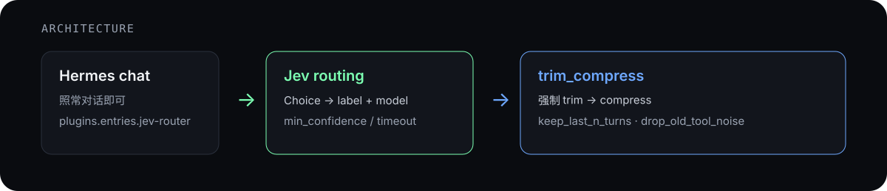

# jev-router — Hermes × Jev（TypeSafe 直连）

<p align="center">
  
</p>

给 [Hermes Agent](https://hermes-agent.nousresearch.com/) 加两件事：

1. **模型路由**：每轮调用前用 TypeSafe **Jev** 选模型（简单走便宜、复杂／工具重／长上下文走更强），失败或低置信回退主模型。
2. **先裁再压**：上下文引擎 `trim_compress` 强制 **trim → compress**，禁止不裁直接压。

硬规矩：只 TypeSafe 直连（环境变量 `TYPESAFE_API_KEY`）；**禁止** Vercel AI Gateway；密钥不进仓、不打印。

<p align="center">
  
</p>

## 前置条件

1. **Hermes CLI 已安装**

```bash
curl -fsSL https://hermes-agent.nousresearch.com/install.sh | bash -s -- --skip-browser
export PATH="$HOME/.local/bin:$PATH"
hermes --version
```

2. **主模型已配好**（示例：DeepSeek）

- `~/.hermes/.env` 里有对应 provider Key
- `~/.hermes/config.yaml` 例如：`provider: deepseek`，`model.default: deepseek-flash`

3. **TypeSafe Key 在环境里**

```bash
export TYPESAFE_API_KEY=...   # 或写入 ~/.hermes/.env，由 Hermes 加载；不要把值写进 git
```

4. **`typesafe_sdk` 可导入**：装进 Hermes 所用的 Python 即可；若装在单独 venv，用环境变量指过去（与当前解释器同版本）：

```bash
export JEV_ROUTER_TYPESAFE_VENV=/path/to/typesafe-venv
# 或直接给 site-packages（可用 : 分隔多个）
export JEV_ROUTER_TYPESAFE_SITE_PACKAGES=/path/to/typesafe-venv/lib/python3.x/site-packages
```

## 安装插件（约 1 分钟）

在本仓根目录：

```bash
export PATH="$HOME/.local/bin:$PATH"
cd /path/to/hermes-jev-router
bash scripts/install_local.sh
```

脚本会：symlink 到 `~/.hermes/plugins/jev-router`；必要时复制 `config.example.yaml` → `~/.hermes/jev-router.yaml`；启用 `plugins.entries.jev-router`；把空的／`compressor` 的 `context.engine` 写成 **`trim_compress`**。

手工等价：

```bash
ln -sfn "$(pwd)" ~/.hermes/plugins/jev-router
hermes plugins enable jev-router
# 编辑 ~/.hermes/config.yaml → context.engine: trim_compress
```

确认：

```bash
hermes plugins list --plain | grep -i jev
hermes plugins doctor ~/.hermes/plugins/jev-router
# 期望：hooks 已注册（现为 3 个）；无阻断错误
```

## 日常使用

装好后照常开 Hermes 即可：

```bash
hermes
```

每轮大致：`pre_llm_call` → Jev Choice（如 `cheap` / `primary` / `complex`）→ 改写本轮 `model`；超时／异常／低置信 → 主模型；压缩时走 `trim_compress`。

事件日志默认：`$HERMES_HOME/jev-router/events.jsonl`（未设 `HERMES_HOME` 时即 `~/.hermes/...`），权限 0600。

## 开 / 关

| 作用 | 推荐环境变量 | 旧别名 | 效果 |
|------|----------------|--------|------|
| 关路由 | `JEV_ROUTER_ROUTING_ENABLED=false` | `HERMES_JEV_ROUTING=0` | 一直用主模型 |
| 关裁剪 | `JEV_ROUTER_TRIM_ENABLED=false` | `HERMES_JEV_TRIM=0` | 跳过 trim；compress 仍可跑 |
| 卸整插件 | `hermes plugins disable jev-router` | | 回退 Hermes 默认 |

两者都设时以 `JEV_ROUTER_*` 为准。开关类环境变量拼错（如 `ture`）按 `false` 处理。

## 配置要点

优先级从低到高：`~/.hermes/jev-router.yaml`（扁平字段或 `jev_router:` 块）→ `config.yaml` 顶层 `jev_router:` 块 → `plugins.entries.jev-router.settings` → 环境变量。字段别名：`enabled` = `routing_enabled`，`main_model` = `primary_model`。常用字段默认见 `plugin.yaml` / `settings.py`（如 `min_confidence=0.55`、`timeout_seconds=8`、`primary_model=deepseek-flash`、`keep_last_n_turns=6`）。

布尔字段只认 `true/false/yes/no/on/off/1/0`；YAML 里写成字符串 `"false"` 也按关处理，无法识别的值回落到默认值。

引擎名必须是 `trim_compress`（不要用旧文档里的 `jev-trim-compress`）。

## 怎么验

```bash
cd /path/to/hermes-jev-router
bash scripts/install_local.sh
hermes plugins doctor ~/.hermes/plugins/jev-router --ci
python3 scripts/eval_routing.py --force-live          # → notes/reports/routing-eval.md（gitignored）
python3 scripts/prove_trim_compress.py                # → notes/reports/trim-compress-proof.md
JEV_ROUTER_ROUTING_ENABLED=false python3 scripts/eval_routing.py --force-live
python3 scripts/prove_auto_approve.py                 # $0：自动同意 fail-closed 矩阵，失败则非 0 退出
```

## 已知限制

- 离线顺序证明里的压缩步是**确定性摘要**，不是完整肉眼聊一轮验收。
- hooks 可见不等于已强制做完整交互 chat 确认。
- `cheap` 与 `primary` 若配成同一 model id，对照仍可跑，但体感「没换模型」。
- 禁止把买家大模型 Key 代持进本方案。

## 目录

```text
plugin.yaml  LICENSE  __init__.py
routing.py  engine.py  trim.py  settings.py  events.py  timeouts.py  auto_approve.py
jev_router/flags.py         # 旧版开关实现，未被引用；实际以 settings.py 为准
data/routing_samples.jsonl
scripts/install_local.sh  eval_routing.py  prove_trim_compress.py
scripts/prove_auto_approve.py  hardline_ack.py
config.example.yaml
```

## License

MIT — 见 `LICENSE`。

## 自动同意（可选，默认关）

> **需要宿主支持**：自动同意依赖 Hermes 提供 `ctx.register_approval_policy()`（approval-policy 扩展）。**官方原版 Hermes 没有这个接口**，此时插件只记一条日志、不注册策略，所有审批照旧走人审——单靠本插件无法自动同意。

Hermes 走到共享人审闸前，可先问 TypeSafe Jev。**仅高置信 `approve` → 宿主 `once`（只本次）**；`deny`／`unsure`／低置信／畸形／超时／异常 → `needs_human`（原人审；无人则 fail-closed）。**不**做 session／always，**不**复用 YOLO／`approvals.mode: off`。

```yaml
# ~/.hermes/jev-router.yaml 的 jev_router: 块，或 plugins.entries.jev-router.settings
auto_approve_enabled: true
auto_approve_confidence: 0.80   # 低于 0.5 按 0.5 计
```

```bash
# 或环境变量
export JEV_ROUTER_AUTO_APPROVE_ENABLED=true
# $0 演示（不打 TypeSafe）；设置后启动会打 warning，硬禁请求一律拒用 mock
export JEV_ROUTER_AUTO_APPROVE_MOCK=approve   # deny|unsure|low_confidence|malformed|timeout|error
```

硬禁第二开关（默认关；主开关关时无效）：

```bash
export JEV_ROUTER_AUTO_APPROVE_HARDLINE_ENABLED=true
# 必须先交互式风险确认（写 $HERMES_HOME/jev-router/hardline-ack.json，0600）：
python3 scripts/hardline_ack.py            # --status 查看，--revoke 撤销
```

ack 绑定当前风险文案的哈希；文案改动后须重新确认，手写的 ack 文件不会被接受。

安全边界：

- 用户 `approvals.deny` 由**宿主**在调用策略之前拦截，本插件看不到也无法放行被 deny 的命令。
- 发给 Jev（TypeSafe，第三方）的是宿主已脱敏、插件再次尽力脱敏并截断到 400 字符的命令文本；脱敏是尽力而为，不是安全边界。
- 超时取 `min(auto_approve_timeout_seconds, 宿主策略超时 - 0.5s)`，到点立即交回人审。

日志：`$HERMES_HOME/jev-router/events.jsonl`（`type: auto_approve`；`decided_by` 为 `jev` / `mock` / `none`（未询问）；只记 digest 与 pattern，不记原始命令／密钥）。

